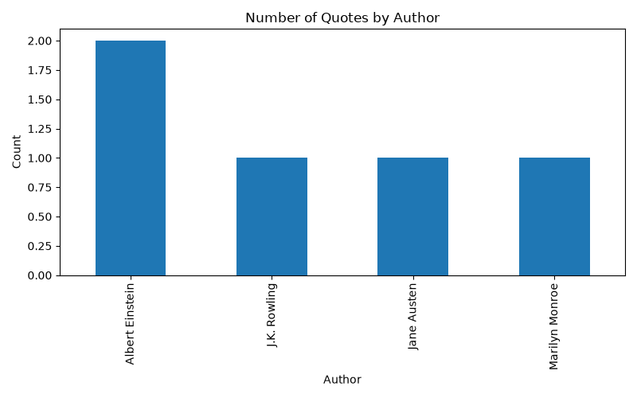

# quotes_pandas_analysis
## What I Did
- Loaded CSV data using pandas
- Checked data info and missing values
- Found unique authors and quote counts
- Filtered data for specific authors
- Created bar chart visualization
- Saved output to CSV

## Tools Used
Python, Pandas, Matplotlib, Google Colab

## Output

